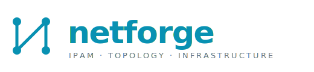

<p align="center">
  
</p>

<p align="center">
  <strong>Self-hosted IPAM and network infrastructure management.</strong><br>
  Subnets · VLANs · switches · ports · graph topology.
</p>

<p align="center">
  <a href="LICENSE"></a>
  
  
  
  
</p>

---

Most network documentation lives in Excel files, sticky notes, and the memory of whoever set it up. Netforge is a single source of truth for your IP plan, VLANs, switches, cabling and topology — with full change history and an interactive graph view.

## Features

- **IPAM** — IPv4 subnets with overlap prevention enforced in the database (GiST exclusion constraint), reserved / assigned / DHCP addresses, free-IP calculation in SQL.
- **Switches, ports, VLANs** — auto-generated ports, access / trunk / hybrid modes, native + tagged VLANs, connected-device tracking.
- **Interactive topology** — Cytoscape.js graph with drag, zoom, auto-layout, PNG export.
- **Global search, CSV import / export, full audit log, Entra ID SSO (OIDC).**
- **100% self-hosted** — everything runs under Docker Compose.

## Stack

| Layer | Technology |
|-------|------------|
| Backend | Python 3.12 · FastAPI · SQLAlchemy 2.0 async · Alembic |
| Database | PostgreSQL 16 (`INET` / `CIDR` / `MACADDR`, GiST exclusion, triggers) |
| Frontend | Vue 3 · Vite · TypeScript · Tailwind · Pinia |
| Topology | Cytoscape.js |
| Auth | OIDC (Microsoft Entra ID) |
| Deployment | Docker Compose |

## Quick start

```bash
git clone https://github.com/<your-org>/netforge.git && cd netforge
cp .env.example .env
docker compose -f docker-compose.dev.yml up -d
docker compose -f docker-compose.dev.yml exec backend alembic upgrade head
curl http://localhost:8000/api/health
```

Interactive OpenAPI docs at `http://localhost:8000/api/docs`. For production, see [docs/07-deployment.md](docs/07-deployment.md).

## Status

**Alpha.** The full specification is committed under [`docs/`](docs/) and the backend scaffold (phase 0-1) is in place. Frontend, auth and CRUD endpoints land phase by phase — see the [roadmap](docs/10-roadmap.md).

## Documentation

The full specification lives in [`docs/`](docs/) — 11 short documents covering vision, architecture, data model, REST API, frontend, auth, deployment, CSV import, topology, roadmap and security.

## Contributing

Contributions are welcome — please read [CONTRIBUTING.md](CONTRIBUTING.md) before opening a PR.

## License

MIT — see [LICENSE](LICENSE).
